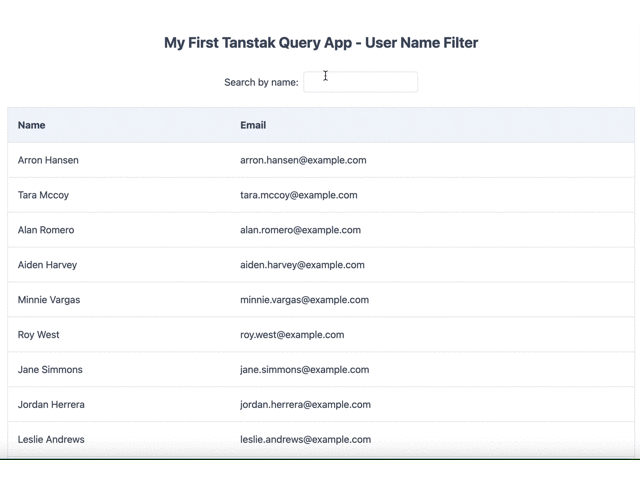

# App Overview

This is my first project using Tanstak Query. It displays a list of random users and allows you to filter them by name.

To preview the app, please visit [here](https://suefrontend.github.io/first-tanstak-app/)

## Errors I encountered

When I first opened the app on the Github Page, I encountered an error and couldn't preview it. This was due to the API taking some time to load the data, and me using the `.map` method before the data was available.

To fix the issue, I set `isLoading` method from useQuery and added a condition to display a message while the app was fetching the data. With this modification, the `.map` method only ran after the data was available, and the app rendered without any errors.

## Benefit of using useQuery over useEffect

While using useEffect for data fetching is still a good approach, it can require more code compared to using useQuery.

For instance, when using useEffect, you often have to create local state for error and loading status. With useQuery, this is unnecessary since the hook automatically handles it for you.

Additionally, you don't have to worry about second arguments! To ensure that the effect runs only when the specified dependencies change, useEffect requires you to pass in an array of dependencies as the second argument. With useQuery, there's no need to worry about it.

## Disable re-fetching methods

I disabled `refetchOnWindowFocus` and `refetchOnMount` to prevent app from re-fetching data everytime the screen is focused. Otherwise it will re-generate a new set of random users, which makes users confused.

## Use derived state to show filtered data

I utilized **derived state** for the filtered data since it can be computed from existing data and does not require re-rendering.

## API

I used [Random User Generator](https://randomuser.me) to fetch random users data.

## Other Frameworks and Libraries

I used the following framework and library:

- Axios
- Tailwind CSS

## Available Scripts

To preview the project, please run:

`npm start`
